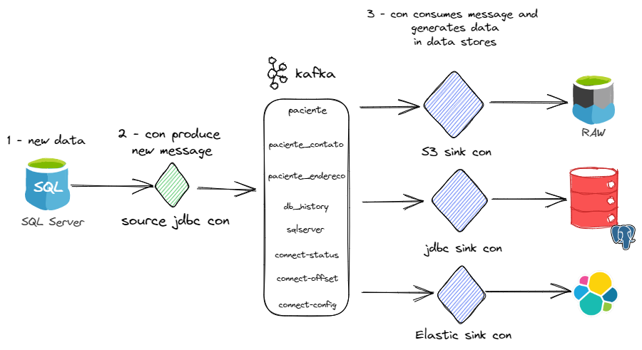
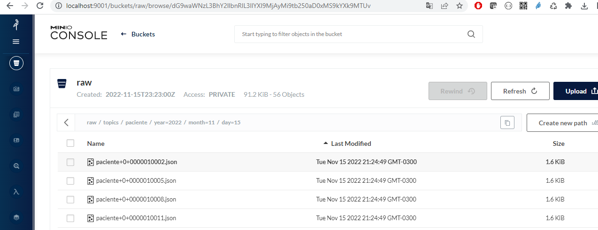

# Demo Kafka Connect

Demo com objetivo didático, mostrando na prática o uso do Kafka Connect para Streamind de dados em diferentes data stores (source & sink)

#### Topologia


               
### Uso

Setup

```sh
# Start the application
docker-compose up --build

# Setup SQL Server DB
docker exec -it sqlserver bash -c "\/opt/mssql-tools/bin/sqlcmd -S localhost -U sa -P P@ssw0rd -d master -i /opt/mssql/setup/db.sql"

# Start SQL Server connector
curl -i -X POST -H "Accept:application/json" -H  "Content-Type:application/json" http://localhost:8083/connectors/ -d @connectors/source-sqlserver-connector.json

# Start PostgreSQL JDBC Sink connector
curl -i -X POST -H "Accept:application/json" -H  "Content-Type:application/json" http://localhost:8083/connectors/ -d @connectors/sink-jdbc-connector.json

# Start Elastic Sink connector
curl -i -X POST -H "Accept:application/json" -H  "Content-Type:application/json" http://localhost:8083/connectors/ -d @connectors/sink-elastic-connector.json

# Start S3 Sink connector
curl -i -X POST -H "Accept:application/json" -H  "Content-Type:application/json" http://localhost:8083/connectors/ -d @connectors/sink-s3-minio-connector.json


```

Verificar os dados do banco SQL Server

```sh
docker compose -f docker-compose.yaml exec sqlserver bash -c '\/opt/mssql-tools/bin/sqlcmd -S localhost -U sa -P $SA_PASSWORD -d db -y 30 -Y 30 -q "select top 10 id_paciente, nome, cpf, data_nascimento from paciente"'
```

Verificar se o banco Postgres tem o mesmo conteúdo

```sh
docker compose -f docker-compose.yaml exec postgres bash -c 'psql -U $POSTGRES_USER $POSTGRES_DB -c "select id_paciente, nome, cpf, data_nascimento from paciente"'
```

### Inclusão de Dados 

Incluir um registro no SQL Server

```sh
docker compose -f docker-compose.yaml exec sqlserver bash -c '\/opt/mssql-tools/bin/sqlcmd -S localhost -U sa -P $SA_PASSWORD -d db'
```
```sql
INSERT INTO db.dbo.paciente (nome, cpf, data_nascimento, data_hora_inclusao, usuario_inclusao, data_hora_alteracao, usuario_alteracao, status) VALUES('Leonor Cunha Almeida', '83799492267', '1952-12-09', getdate(), 'admin', null, null, 'A');
GO
```

Verificar se o dado foi incluído no Postgres

```sh
docker compose -f docker-compose.yaml exec postgres bash -c 'psql -U $POSTGRES_USER $POSTGRES_DB -c "select id_paciente, nome, cpf, data_nascimento from paciente order by data_hora_inclusao desc"'
```

Verificar se o dado foi incluído no Elastic

```sh
curl --location --request GET 'http://localhost:9200/paciente/_search?pretty&q=nome:Leonor~1'
```

Verificar se foi gerado no bucket do Minio



### Alteração de Dados 

Alterar o nome na tabela paciente no SQL Server

```sh
docker compose -f docker-compose.yaml exec sqlserver bash -c '\/opt/mssql-tools/bin/sqlcmd -S localhost -U sa -P $SA_PASSWORD -d db'
```
```sql
UPDATE db.dbo.paciente set nome = 'Leonor Cunha Almeida 2' where id_paciente = 13588;
GO
```

Verificar se o dado foi atualizado no Postgres

```sh
docker compose -f docker-compose.yaml exec postgres bash -c 'psql -U $POSTGRES_USER $POSTGRES_DB -c "select id_paciente, nome, cpf, data_nascimento from paciente order by data_hora_inclusao desc"'
```

Verificar se o dado foi atualizado no Elastic

```sh
curl --location --request GET 'http://localhost:9200/paciente/_search?pretty&q=nome:Leonor~1'
```

### Deleção de Dados 

Deletar dado na tabela paciente no SQL Server


```sh
docker compose -f docker-compose.yaml exec sqlserver bash -c '\/opt/mssql-tools/bin/sqlcmd -S localhost -U sa -P $SA_PASSWORD -d db'
```
```sql
DELETE FROM db.dbo.paciente where id_paciente = 13588;
GO
```

Verificar se o dado foi deletado no Postgres

```sh
docker compose -f docker-compose.yaml exec postgres bash -c 'psql -U $POSTGRES_USER $POSTGRES_DB -c "select id_paciente, nome, cpf, data_nascimento from paciente order by data_hora_inclusao desc"'
```

Verificar se o dado foi deletado no Elastic

```sh
curl --location --request GET 'http://localhost:9200/paciente/_search?pretty&q=nome:Leonor~1'
```
### Desfazer ambiente
```sh
docker-compose down
```

### Materiais de apoio


- [Kafka Connect 101](https://developer.confluent.io/learn-kafka/kafka-connect/intro/)
- [Confluent Hub](https://www.confluent.io/hub/)
- [Fake Generator](https://www.fakenamegenerator.com/gen-random-br-br.php)
- [KAFKA e Minio](https://blog.min.io/kafka_and_minio/)
- [Elastic queries](https://logz.io/blog/elasticsearch-queries/)